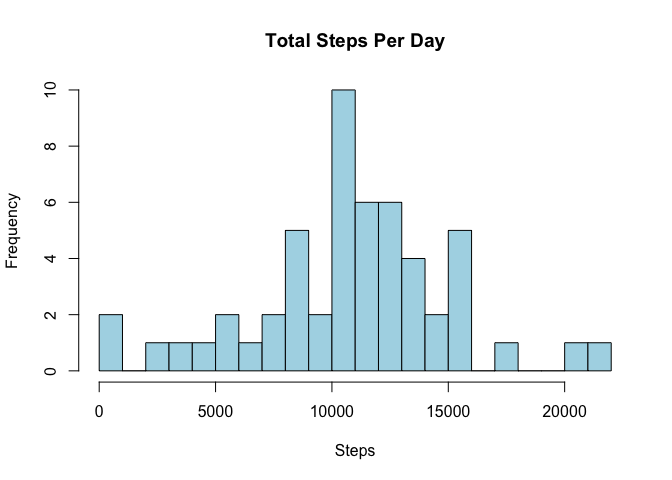
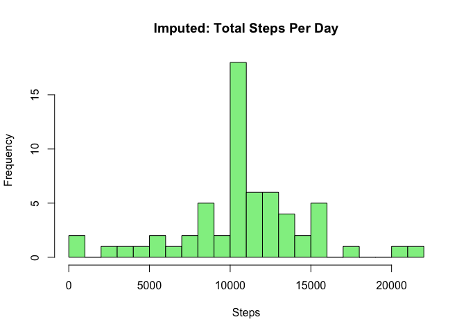
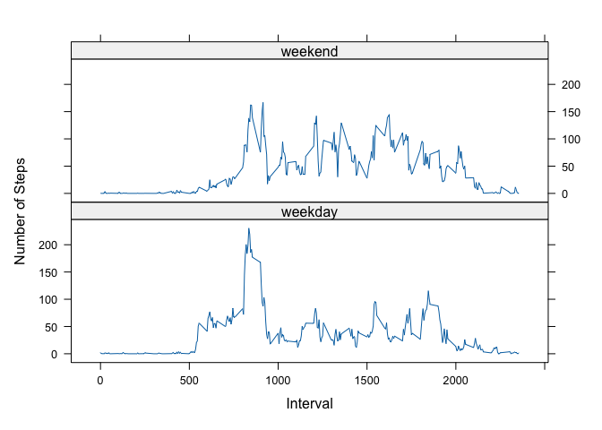

## Introduction

This assignment makes use of data from a personal activity monitoring device. This device collects data at 5 minute intervals through out the day. The data consists of two months of data from an anonymous individual collected during the months of October and November, 2012 and include the number of steps taken in 5 minute intervals each day.

The data for this assignment can be downloaded from the course web site:

- Dataset: [Activity monitoring data](https://d396qusza40orc.cloudfront.net/repdata%2Fdata%2Factivity.zip) [52K]

The variables included in this dataset are:

- steps: Number of steps taking in a 5-minute interval (missing values are coded as **NA**)
- date: The date on which the measurement was taken in YYYY-MM-DD format
- interval: Identifier for the 5-minute interval in which measurement was taken

## Loading and preprocessing the data

### Read the dataset


``` r
unzip("activity.zip")
data <- read.csv("activity.csv")
```

### Convert date column to Date type

``` r
data$date <- as.Date(data$date)
```
### display the structure of the data

``` r
str(data)
```

```
## 'data.frame':	17568 obs. of  3 variables:
##  $ steps   : int  NA NA NA NA NA NA NA NA NA NA ...
##  $ date    : Date, format: "2012-10-01" "2012-10-01" ...
##  $ interval: int  0 5 10 15 20 25 30 35 40 45 ...
```

## What is mean total number of steps taken per day?

### Calculate the total number of steps taken per day

``` r
library(dplyr)
# Remove NA values
clean_data <- data %>% filter(!is.na(steps))
# Calculate total number of steps per day
daily_steps <- clean_data %>%
  group_by(date) %>%
  summarise(total = sum(steps))
```

### Histogram of the total number of steps taken each day


``` r
hist(daily_steps$total, main = "Total Steps Per Day", xlab = "Steps", col = "lightblue", breaks = 20)
```

<!-- -->


### Mean and median number of steps taken each day


``` r
mean_steps <- mean(daily_steps$total)
median_steps <- median(daily_steps$total)
```


``` r
mean_steps
```

```
## [1] 10766.19
```


``` r
median_steps
```

```
## [1] 10765
```

## What is the average daily activity pattern?

### Calculate average steps per 5-minute interval

``` r
interval_avg <- clean_data %>%
  group_by(interval) %>%
  summarise(avg_steps = mean(steps))
```

### Time series plot of average steps across intervals

``` r
plot(interval_avg$interval, interval_avg$avg_steps, type = "l",
     xlab = "5-Minute Interval", ylab = "Average Number of Steps",
     main = "Average Daily Activity Pattern")
```

<!-- -->

### Find the 5-minute interval with maximum average steps

``` r
max_interval <- interval_avg[which.max(interval_avg$avg_steps), "interval"]
max_interval
```

```
## # A tibble: 1 × 1
##   interval
##      <int>
## 1      835
```

## Imputing missing values

### Calculate the total number of missing values

``` r
sum(is.na(data$steps))
```

```
## [1] 2304
```

### Replace NAs with the mean for that 5-minute interval

``` r
imputed_data <- data %>%
  left_join(interval_avg, by = "interval") %>%
  mutate(steps = ifelse(is.na(steps), avg_steps, steps)) %>%
  select(steps, date, interval)
```

### Recalculate total steps per day with imputed data

``` r
daily_imputed <- imputed_data %>%
  group_by(date) %>%
  summarise(total = sum(steps))
```

### Plot histogram of total steps per day after imputation

``` r
hist(daily_imputed$total, main = "Imputed: Total Steps Per Day", xlab = "Steps", col = "lightgreen", breaks = 20)
```

<!-- -->

### The new mean and median total number of steps taken per day

``` r
mean_imputed <- mean(daily_imputed$total)
median_imputed <- median(daily_imputed$total)
```


``` r
mean_imputed
```

```
## [1] 10766.19
```


``` r
median_imputed
```

```
## [1] 10766.19
```


## Are there differences in activity patterns between weekdays and weekends?

# Add a factor variable indicating weekday or weekend


``` r
imputed_data <- imputed_data %>%
  mutate(weekday = weekdays(date),
         day_type = ifelse(weekday %in% c("Saturday", "Sunday"), "weekend", "weekday")) %>%
  group_by(interval, day_type)
```

### Calculate average steps by interval and day type

``` r
interval_by_day <- imputed_data %>%
  group_by(interval, day_type) %>%
  summarise(avg_steps = mean(steps))
```

```
## `summarise()` has grouped output by 'interval'. You can override using the
## `.groups` argument.
```

### Panel plot comparing weekday and weekend activity patterns

``` r
library(lattice)
xyplot(avg_steps ~ interval | day_type, data = interval_by_day,
       layout = c(1, 2), type = "l", xlab = "Interval", ylab = "Number of Steps")
```

<!-- -->
